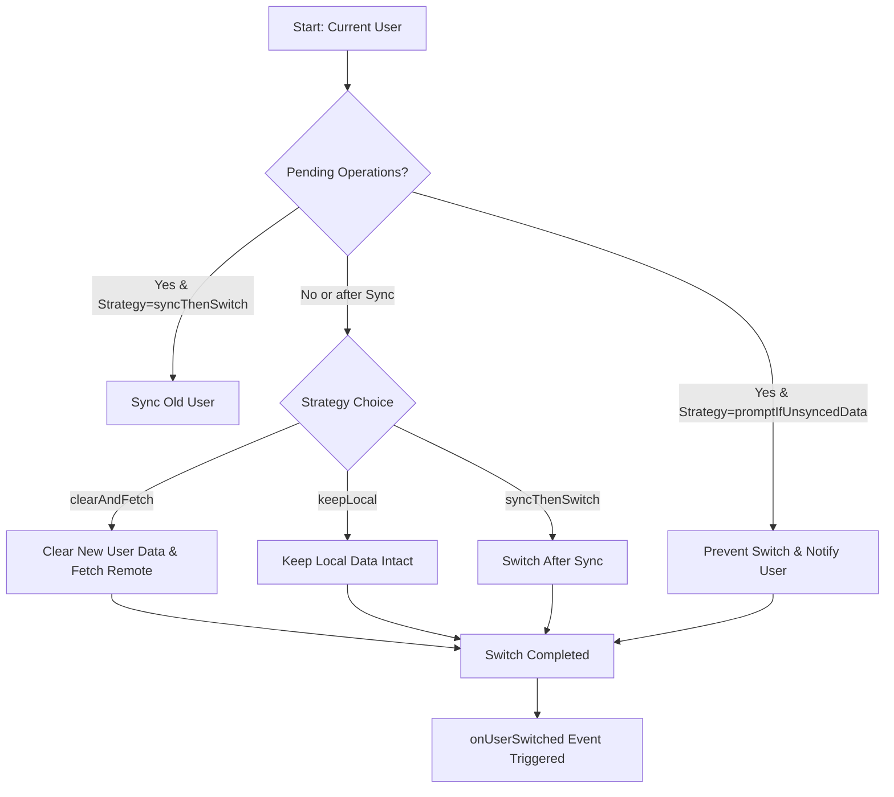

<p align="center">
  
</p>

# 🧠 **Datum** — Offline-First Data Synchronization Framework for Dart & Flutter

<a href="https://pub.dev/packages/datum"></a> <a href="https://github.com/your-username/datum/blob/main/LICENSE"></a>  

> **Smart ⚡ Reactive 🔄 Universal 🌍**
>
> Datum unifies your **local database** and **remote backend** with intelligent syncing, automatic conflict resolution, and real-time data updates — all through a single, type-safe API.

---

## ✨ **Key Features**

| Feature                     | Description                                                                              |
| :-------------------------- | :--------------------------------------------------------------------------------------- |
| ⚡ **Offline-First Sync**    | Read/write instantly — automatic sync when connection returns.                           |
| 🧩 **Adapter-Based Design** | Plug in any local DB (Hive, Isar, SQLite) and remote source (REST, Supabase, Firestore). |
| 🔁 **Two-Way Sync**         | Pushes local changes and pulls remote updates automatically.                             |
| 🚦 **Conflict Resolution**  | Built-in strategies (`LastWriteWins` or custom resolvers).                               |
| 🧱 **Schema Migrations**    | Migrate data seamlessly between app versions.                                            |
| 🔒 **User-Scoped Data**     | Isolated storage & queues for each user.                                                 |
| 👥 **Multi-User Support**   | Switch users seamlessly — no data leakage.                                               |
| 📡 **Reactive Streams**     | Observe changes live using `Stream`s.                                                    |
| 🔔 **Sync Events**          | Listen to sync start, success, failure, and conflict events.                             |
| 🧰 **Customizable Config**  | Control retry policies, backoff, sync intervals, etc.                                    |
| 💾 **Background Sync**      | Auto-sync when app resumes.                                                              |
| 🌍 **Cross-Platform**       | Works on Android, iOS, macOS, Windows, Linux, and (soon) Web.                            |

---

## 🧭 **Platform Support**

| Platform |          Status         |
| :------- | :---------------------: |
| Android  |            ✅            |
| iOS      |            ✅            |
| macOS    |            ✅            |
| Windows  |            ✅            |
| Linux    |            ✅            |
| Web      | ⚠️ (depends on adapter) |

---

## 📦 **Installation**

```yaml
dependencies:
  datum: ^0.0.1
```

Then run:

```bash
flutter pub get
```

---

## 🚀 **Getting Started**

### 1️⃣ Initialize Datum

```dart
final datum = await Datum.initialize(
  config: DatumConfig.defaultConfig().copyWith(
    schemaVersion: 1,
    autoStartSync: true,
  ),
  connectivityChecker: MyConnectivityChecker(),
  registrations: [noteRegistration],
);
```

---

### 2️⃣ Define Your Entity

```dart
class Note extends DatumEntity {
  final String title;
  final String content;

  Note({
    required super.id,
    required super.userId,
    required this.title,
    required this.content,
  });

  Map<String, dynamic> toJson() => {
    'id': id,
    'userId': userId,
    'title': title,
    'content': content,
  };

  static Note fromJson(Map<String, dynamic> json) => Note(
    id: json['id'],
    userId: json['userId'],
    title: json['title'],
    content: json['content'],
  );
}
```

---

### 3️⃣ Define Adapters

#### 🏠 **Local Adapter (Hive Example)**

```dart
class NoteLocalAdapter extends LocalAdapter<Note> {
  late Box<Note> _box;

  @override
  Future<void> initialize() async {
    if (!Hive.isAdapterRegistered(1)) {
      Hive.registerAdapter(NoteAdapter());
    }
    _box = await Hive.openBox('notes');
  }

  @override
  Future<void> create(Note note) async => _box.put(note.id, note);
  @override
  Future<Note?> read(String id, {String? userId}) async => _box.get(id);
  @override
  Future<List<Note>> readAll({String? userId}) async => _box.values.toList();
  @override
  Future<bool> delete(String id, {String? userId}) async {
    await _box.delete(id);
    return true;
  }
}
```

#### ☁️ **Remote Adapter (Supabase Example)**

```dart
class NoteRemoteAdapter extends RemoteAdapter<Note> {
  final SupabaseClient supabase;

  NoteRemoteAdapter(this.supabase);

  @override
  Future<void> create(Note note) async {
    await supabase.from('notes').insert(note.toJson());
  }

  @override
  Future<List<Note>> readAll({String? userId}) async {
    final res = await supabase.from('notes').select().eq('userId', userId);
    return (res as List).map((e) => Note.fromJson(e)).toList();
  }

  @override
  Future<void> delete(String id, {String? userId}) async {
    await supabase.from('notes').delete().eq('id', id);
  }
}
```

---

### 4️⃣ Register & Initialize

```dart
final noteRegistration = DatumRegistration<Note>(
  local: NoteLocalAdapter(),
  remote: NoteRemoteAdapter(supabaseClient),
);

await Datum.initialize(
  config: DatumConfig.defaultConfig(),
  connectivityChecker: MyConnectivityChecker(),
  registrations: [noteRegistration],
);
```

---

## 🧩 **Using Datum**

### 📝 CRUD Operations

```dart
final note = Note(
  id: '123',
  userId: 'user_1',
  title: 'Offline-first FTW!',
  content: 'This is synced automatically.',
);

await Datum.instance.create(note);
final allNotes = await Datum.instance.readAll<Note>(userId: 'user_1');
```

---

### 🔁 Manual Synchronization

```dart
final result = await Datum.instance.synchronize('user_1');
print('Synced ${result.syncedCount} items');
```

---

### 📡 Reactive Functions

| Function                | Description                                   |
| :---------------------- | :-------------------------------------------- |
| `watchAll<T>()`         | Stream all entities of type `T` in real-time. |
| `watchById<T>(id)`      | Stream a single entity by ID.                 |
| `statusForUser(userId)` | Observe current sync status.                  |
| `events`                | Listen to sync lifecycle events.              |
| `metrics`               | Observe real-time synchronization metrics.    |

---

### 🧠 Example: Auto Background Sync

```dart
Timer.periodic(Duration(minutes: 15), (_) async {
  if (await MyConnectivityChecker().isConnected()) {
    await Datum.instance.synchronize('user_1');
  }
});
```

---

### ⚙️ Cleanup

```dart
await Datum.instance.dispose();
```

---

## 🩺 **Sync Health & Metrics**

Stay informed about your app’s sync performance in real time.

### 🔹 `DatumHealth`

Represents current sync status with states like:
`healthy`, `syncing`, `pending`, `degraded`, `offline`, and `error`.

```dart
manager.health.listen((health) {
  print('Current sync status: ${health.status}');
});
```

---

### 🔹 `DatumMetrics`

| Metric                           | Description                          |
| :------------------------------- | :----------------------------------- |
| `totalSyncOperations`            | Total number of sync cycles started. |
| `successfulSyncs`                | Completed successfully.              |
| `failedSyncs`                    | Encountered errors.                  |
| `conflictsDetected`              | Detected data conflicts.             |
| `conflictsResolvedAutomatically` | Resolved using resolver (e.g., LWW). |
| `userSwitchCount`                | Number of user switches in session.  |
| `activeUsers`                    | Unique active users in session.      |

---

## 🔄 **User Switching Made Easy**

Datum handles multiple users gracefully — no manual data cleanup required!

### ✨ Strategies

| Strategy                  | Behavior                                       |
| :------------------------ | :--------------------------------------------- |
| 🧭 `syncThenSwitch`       | Sync old user’s pending data, then switch.     |
| 🔒 `promptIfUnsyncedData` | Prevent switch if unsynced data exists.        |
| 🧼 `clearAndFetch`        | Clear new user data & fetch fresh remote data. |
| 💾 `keepLocal`            | Switch immediately, keeping local data intact. |

---

### 🧩 Mermaid Workflow



> 🔍 Automatically syncs or cleans data per your selected strategy before switching.

---

## 🧩 **Coming Soon**

* 🔥 Built-in adapters for **Isar**, **Drift**, **Supabase**, **Firestore**
* 🕸️ IndexedDB adapter for **Web**
* ⚔️ Smarter conflict resolution strategies
* 🧪 Developer Dashboard for real-time sync insights

---

## 🧑‍💻 **Contributing**

Pull requests welcome!
Found a bug 🐞 or want a new adapter?
👉 Open an issue or PR — we’d love your help.

---

## 🪪 **License**

MIT License © 2025 [**Shreeman Arjun**](https://flutterexplorer.dev)

---

Would you like me to:

* 🧭 Add a **“Quick Demo App”** section with runnable example code (showing both local + remote sync)?
* Or 🎨 include **badges + emoji-style section dividers** (e.g., 🚀 / 🧠 / 🧩) to make it more visually distinctive on GitHub?
