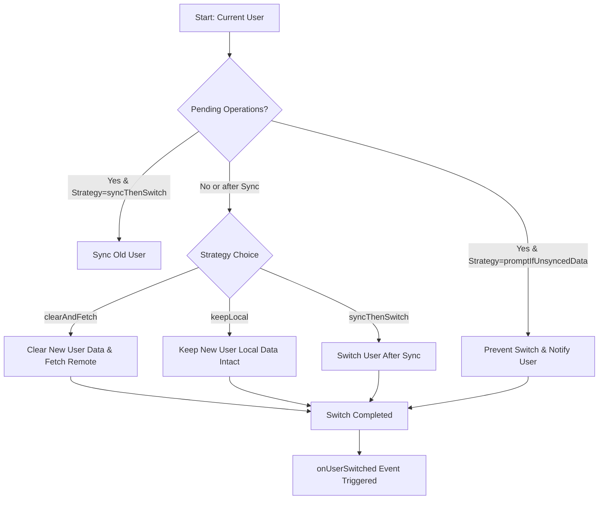

Perfect ✅ — you’re essentially describing a **developer-friendly README** that’s both **marketing-style (feature-rich)** and **practical (step-by-step usage)** — just like top-tier open-source Flutter libraries such as *Drift*, *Hive*, or *Isar*.

Below is a **professionally structured README template** for your `datum` framework that follows your instructions exactly — feature overview first (with emojis), platform support, installation, initialization, entity setup, adapters, sync usage, and advanced tracking/reactive features grouped logically.

---

# 🧠 Datum — The Offline-First Data Synchronization Framework for Flutter

> **Smart. Reactive. Universal.**
> Datum brings together your local database and remote backend with automatic synchronization, conflict resolution, and real-time updates — all under a single, type-safe API.

---

## ✨ Features

| Feature                      | Description                                                                                                 |
| :--------------------------- | :---------------------------------------------------------------------------------------------------------- |
| ⚡ **Offline-First Sync**     | Read/write data instantly — syncs automatically when connection is restored.                                |
| 🧩 **Adapter-Based Design**  | Plug in any local DB (Hive, Isar, SQLite) and any remote source (REST, Supabase, Firestore).                |
| 🔁 **Two-Way Sync**          | Automatically pushes local changes and pulls remote updates.                                                |
| 🚦 **Conflict Resolution**   | Built-in strategies (`LastWriteWins`, custom resolvers supported).                                          |
| 🧱 **Schema Migrations**     | Easily migrate data between versions with custom migration logic.                                           |
| 🔒 **User-Scoped Data**      | Separate storage and sync queues per user.                                                                  |
| 🧍‍♂️ **Multi-User Support** | Switch between multiple signed-in users seamlessly.                                                         |
| 🧭 **Reactive Data Streams** | Real-time change tracking using `Stream`s.                                                                  |
| 🔔 **Sync Events**           | Listen to sync start, success, error, and conflict events.                                                  |
| 🧰 **Customizable Config**   | Define retry policies, backoff strategy, auto-sync intervals, and more.                                     |
| 💾 **Background Sync Ready** | Works even when your app resumes from background.                                                           |
| 🧩 **Cross-Platform**        | Works on **Android**, **iOS**, **macOS**, **Windows**, **Linux**, and **Web** (when supported by adapters). |

---

## 🧭 Platform Support

| Platform |                 Status                 |
| :------- | :------------------------------------: |
| Android  |                    ✅                   |
| iOS      |                    ✅                   |
| macOS    |                    ✅                   |
| Windows  |                    ✅                   |
| Linux    |                    ✅                   |
| Web      | ⚠️ (depends on adapter implementation) |

---

## 📦 Installation

Add **Datum** to your project:

```yaml
dependencies:
  datum: ^0.0.1
```

Then run:

```bash
flutter pub get
```

---

## 🚀 Getting Started

### 1️⃣ Initialize Datum

At app startup, configure Datum once:

```dart
final datum = await Datum.initialize(
  config: DatumConfig.defaultConfig().copyWith(
    schemaVersion: 1,
    autoStartSync: true,
  ),
  connectivityChecker: MyConnectivityChecker(),
  registrations: [
    noteRegistration,
  ],
);
```

---

### 2️⃣ Define Your Entity

All models must extend `DatumEntity`:

```dart
class Note extends DatumEntity {
  final String title;
  final String content;

  Note({
    required super.id,
    required super.userId,
    required this.title,
    required this.content,
  });

  Map<String, dynamic> toJson() => {
    'id': id,
    'userId': userId,
    'title': title,
    'content': content,
  };

  static Note fromJson(Map<String, dynamic> json) => Note(
    id: json['id'],
    userId: json['userId'],
    title: json['title'],
    content: json['content'],
  );
}
```

---

### 3️⃣ Define Adapters

#### 🏠 Local Adapter (Hive Example)

```dart
class NoteLocalAdapter extends LocalAdapter<Note> {
  late Box<Note> _box;

  @override
  Future<void> initialize() async {
    if (!Hive.isAdapterRegistered(1)) {
      Hive.registerAdapter(NoteAdapter());
    }
    _box = await Hive.openBox('notes');
  }

  @override
  Future<void> create(Note note) async => _box.put(note.id, note);
  @override
  Future<Note?> read(String id, {String? userId}) async => _box.get(id);
  @override
  Future<List<Note>> readAll({String? userId}) async => _box.values.toList();
  @override
  Future<bool> delete(String id, {String? userId}) async {
    await _box.delete(id);
    return true;
  }
}
```

#### ☁️ Remote Adapter (Supabase Example)

```dart
class NoteRemoteAdapter extends RemoteAdapter<Note> {
  final SupabaseClient supabase;

  NoteRemoteAdapter(this.supabase);

  @override
  Future<void> initialize() async {}

  @override
  Future<void> create(Note note) async {
    await supabase.from('notes').insert(note.toJson());
  }

  @override
  Future<List<Note>> readAll({String? userId}) async {
    final res = await supabase.from('notes').select().eq('userId', userId);
    return (res as List).map((e) => Note.fromJson(e)).toList();
  }

  @override
  Future<void> delete(String id, {String? userId}) async {
    await supabase.from('notes').delete().eq('id', id);
  }
}
```

---

### 4️⃣ Register and Initialize

```dart
final noteRegistration = DatumRegistration<Note>(
  local: NoteLocalAdapter(),
  remote: NoteRemoteAdapter(supabaseClient),
);

await Datum.initialize(
  config: DatumConfig.defaultConfig(),
  connectivityChecker: MyConnectivityChecker(),
  registrations: [noteRegistration],
);
```

---

## 🧩 Using Datum

### 📝 CRUD Operations

```dart
final note = Note(
  id: '123',
  userId: 'user_1',
  title: 'Offline-first FTW!',
  content: 'This is synced automatically.',
);

await Datum.instance.create(note);
final allNotes = await Datum.instance.readAll<Note>(userId: 'user_1');
```

---

### 🔁 Synchronization

Manually trigger a full sync:

```dart
final result = await Datum.instance.synchronize('user_1');
print('Synced ${result.syncedCount} items');
```

---

### 📡 Reactive Functions

| Function                | Description                                   |
| :---------------------- | :-------------------------------------------- |
| `watchAll<T>()`         | Streams all entities of type `T` in real-time |
| `watchById<T>(id)`      | Stream a single entity by ID                  |
| `statusForUser(userId)` | Observe current sync status                   |
| `events`                | Listen to all sync lifecycle events           |
| `metrics`               | Observe real-time synchronization metrics     |

Example:

```dart
Datum.instance.watchAll<Note>(userId: 'user_1').listen((notes) {
  print('Notes updated: ${notes.length}');
});

Datum.instance.events.listen((event) {
  if (event is DatumSyncErrorEvent) {
    print('Sync failed: ${event.error}');
  }
});

Datum.instance.metrics.listen((metrics) {
  print('Total syncs: ${metrics.totalSyncOperations}, Successful: ${metrics.successfulSyncs}');
});
```

---

### 🧭 Tracking & Grouping Functions

| Category              | Common Functions                                            |
| :-------------------- | :---------------------------------------------------------- |
| **Entity Management** | `create()`, `read()`, `update()`, `delete()`                |
| **Reactive Streams**  | `watchAll()`, `watchById()`, `statusForUser()`              |
| **Synchronization**   | `synchronize()`, `resolveConflicts()`, `retryFailedSyncs()` |
| **Diagnostics**       | `Datum.instance.events`, `Datum.instance.currentStatus()`   |
| **Migrations**        | `Datum.instance.migrate()`, `DatumConfig.migrations`        |

---

### 🧠 Example: Automatic Background Sync

```dart
Timer.periodic(Duration(minutes: 15), (_) async {
  if (await MyConnectivityChecker().isConnected()) {
    await Datum.instance.synchronize('user_1');
  }
});
```

---

### ⚙️ Clean Up

Dispose resources when app closes:

```dart
await Datum.instance.dispose();
```

---

## 🩺 Sync Health & Metrics

Datum provides built-in observability for your synchronization layer — enabling you to **monitor real-time health** and **analyze sync performance**.

### 🔹 `DatumHealth`

`DatumHealth` represents the current operational health of a sync manager.
It emits live updates via a `Stream<DatumHealth>` so you can reactively display or log status changes in your app.

```dart
enum DatumSyncHealth {
  healthy,   // Everything is working normally.
  syncing,   // A synchronization cycle is in progress.
  pending,   // Local changes are waiting to be synced.
  degraded,  // Non-critical issues (e.g., network flakiness).
  offline,   // Remote data source is unreachable.
  error,     // Critical failure; sync cannot continue.
}
```

You can listen to the health stream:

```dart
manager.health.listen((health) {
  print('Current sync status: ${health.status}');
});
```

**Example Usage (UI Binding):**

```dart
StreamBuilder<DatumHealth>(
  stream: manager.health,
  builder: (context, snapshot) {
    final status = snapshot.data?.status ?? DatumSyncHealth.healthy;
    return Text('Status: ${describeEnum(status)}');
  },
);
```

---

### 🔹 `DatumMetrics`

`DatumMetrics` provides an immutable snapshot of all key synchronization statistics collected by Datum:

| Metric                           | Description                                               |
| -------------------------------- | --------------------------------------------------------- |
| `totalSyncOperations`            | Total number of sync cycles started.                      |
| `successfulSyncs`                | Sync cycles completed successfully.                       |
| `failedSyncs`                    | Sync cycles that encountered errors.                      |
| `conflictsDetected`              | Number of data conflicts detected.                        |
| `conflictsResolvedAutomatically` | Conflicts resolved via the active resolver (e.g. LWW).    |
| `userSwitchCount`                | Number of times the active user changed during a session. |
| `activeUsers`                    | Set of unique user IDs active in this session.            |

Example usage:

```dart
// Access current metrics snapshot
final metrics = datum.currentMetrics;

print('Total syncs: ${metrics.totalSyncOperations}');
print('Conflicts resolved automatically: ${metrics.conflictsResolvedAutomatically}');
```

You can also subscribe to real-time metric updates:

```dart
datum.metrics.listen((metrics) {
  debugPrint('Sync metrics updated: $metrics');
});
```

---

### 📊 Example Output

```
DatumMetrics(
  totalSyncs: 14,
  successful: 12,
  failed: 2,
  conflicts: 3
)
```

### ✅ Why It Matters

These APIs allow you to:

* Build **dashboards or developer diagnostics**.
* Track **sync performance across users**.
* Detect **connectivity or reliability issues** early.
* Provide **visible sync status feedback** to users.

---

Got it! GitHub supports **Mermaid diagrams** in Markdown, so we can use a GitHub-compatible Mermaid flowchart. Here's the updated **User Switching section** with a GitHub-ready diagram:

---

## User Switching with `DatumManager`

`DatumManager` allows seamless switching between users while handling local and remote data automatically. You can choose a strategy depending on whether you want to keep unsynced data, synchronize it, or start fresh for the new user.

### Step 1: Import Dependencies

```dart
import 'package:datum/datum.dart';
```

### Step 2: Initialize `DatumManager`

```dart
final manager = DatumManager<MyEntity>(
  localAdapter: myLocalAdapter,
  remoteAdapter: myRemoteAdapter,
  connectivity: myConnectivityChecker,
  datumConfig: const DatumConfig(),
  localObservers: [myObserver], // optional observer hooks
);

await manager.initialize();
```

### Step 3: Switch Users

```dart
final result = await manager.switchUser(
  oldUserId: 'oldUser',
  newUserId: 'newUser',
  strategy: UserSwitchStrategy.syncThenSwitch,
);

if (result.success) {
  print('Switched to newUser successfully');
} else {
  print('Switch failed: ${result.errorMessage}');
}
```

**Available Strategies:**

| Strategy               | Behavior                                                         |
| ---------------------- | ---------------------------------------------------------------- |
| `promptIfUnsyncedData` | Prevent switch if old user has unsynced data.                    |
| `syncThenSwitch`       | Synchronize old user's pending operations, then switch.          |
| `clearAndFetch`        | Clears new user's local data and fetches fresh data from remote. |
| `keepLocal`            | Switch without touching local or remote data.                    |

### Step 4: Listen for User Switch Events

```dart
manager.onUserSwitched.listen((event) {
  print('Switched from ${event.previousUserId} to ${event.newUserId}');
  if (event.hadUnsyncedData) {
    print('Old user had unsynced data!');
  }
});
```

### Step 5: Optional Observer Hooks

```dart
class MyObserver extends DatumObserver<MyEntity> {
  @override
  void onUserSwitchStart(String? oldUserId, String newUserId, UserSwitchStrategy strategy) {
    print('Switch started from $oldUserId to $newUserId using $strategy');
  }

  @override
  void onUserSwitchEnd(DatumUserSwitchResult result) {
    print('Switch ended with success: ${result.success}');
  }
}
```

---

### Workflow Diagram



**Diagram Explanation:**

1. Checks if the old user has pending operations.
2. Depending on the chosen strategy, it may prevent switching, synchronize, or clear/fetch data.
3. After the switch, the `onUserSwitched` event is triggered, so your UI or business logic can respond.

---

If you want, I can **also create a minimal “cheat sheet table” with short code snippets for all 4 strategies** so users can quickly copy-paste them.

Do you want me to do that next?


## 🧩 Coming Soon

* 🔥 Built-in adapters for **Isar**, **Drift**, **Supabase**, and **Firestore**
* 🕸️ Web support with IndexedDB adapter
* ⚔️ Advanced conflict resolution strategies
* 🧪 Developer dashboard for sync monitoring

---

## 🧑‍💻 Contributing

Contributions are welcome! Please open issues or PRs on GitHub — whether it's documentation improvements, feature ideas, or adapter implementations.

---

## 🪪 License

MIT License © 2025 [Shreeman Arjun](https://flutterexplorer.dev)
