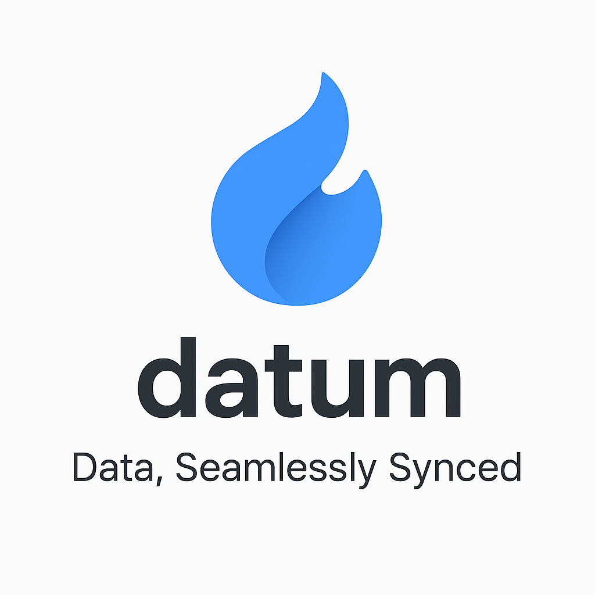
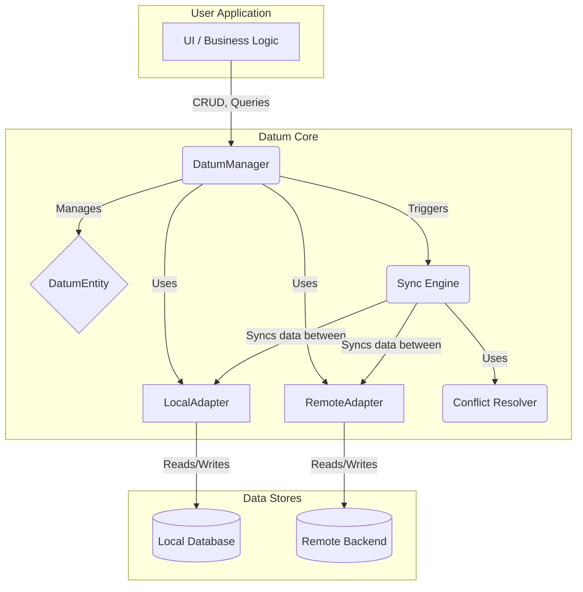
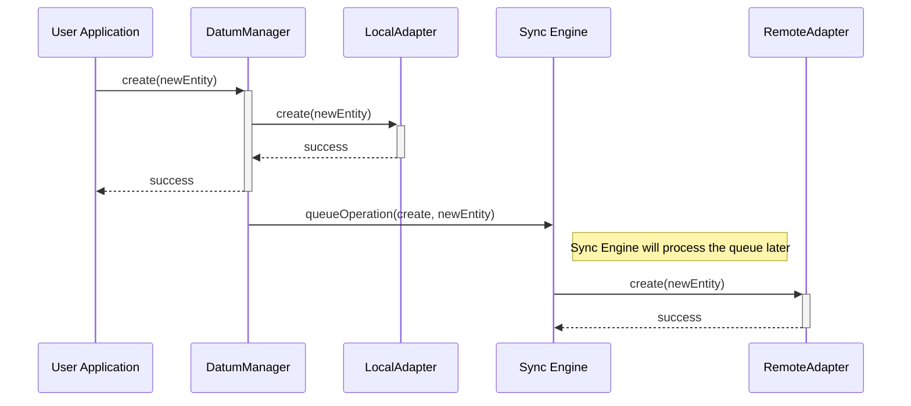
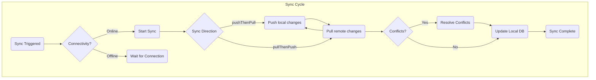
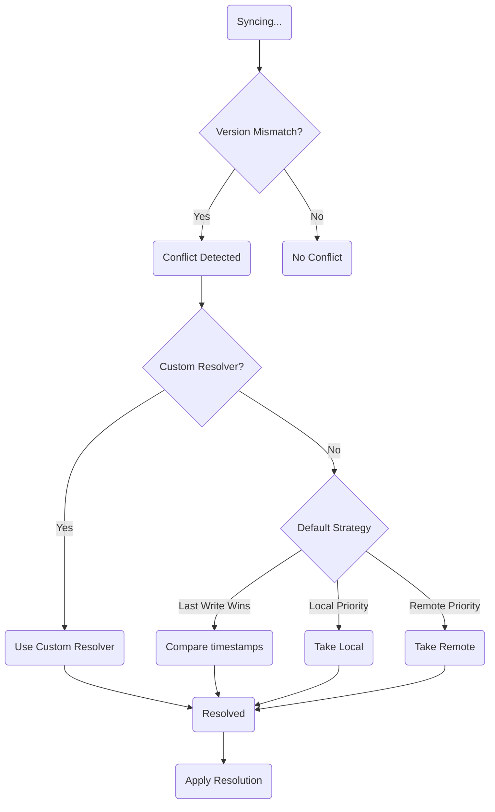

<p align="center">
  
</p>

# 🧠 **Datum** — Offline-First Data Synchronization Framework for Dart & Flutter

<a href="https://pub.dev/packages/datum"></a> <a href="https://github.com/your-username/datum/blob/main/LICENSE"></a>  

> **Smart ⚡ Reactive 🔄 Universal 🌍**
>
> Datum unifies your **local database** and **remote backend** with intelligent syncing, automatic conflict resolution, and real-time data updates — all through a single, type-safe API.

---

## Core Concepts

Datum is built around a few core concepts:

- **`DatumEntity`**: The base class for your data models. It requires a unique `id`, `userId`, and other metadata for synchronization.
- **`Adapter`**: The bridge between Datum and your data sources. There are two types of adapters:
    - **`LocalAdapter`**: Manages data persistence on the device (e.g., Hive, Isar, SQLite).
    - **`RemoteAdapter`**: Communicates with your backend (e.g., REST API, Supabase, Firestore).
- **`DatumManager`**: The main entry point for interacting with your data. It provides methods for CRUD operations, queries, and synchronization.
- **`DatumRegistration`**: A class that holds the local and remote adapters for a specific `DatumEntity`.
- **Offline-First:** All CRUD operations are performed on the local database first, ensuring a snappy user experience even without a network connection. Datum then automatically syncs the data with the remote backend when the connection is available.

---

## 🚀 Getting Started

### 1. Installation

Add this to your package's `pubspec.yaml` file:

```yaml
dependencies:
  datum: ^0.0.1
```

Then run `flutter pub get`.

### 2. Initialization

Initialize Datum once in your application. A good place for this is in your `main.dart` or a service provider.

```dart
import 'package:datum/datum.dart';
import 'package:supabase_flutter/supabase_flutter.dart';
// ... other imports

Future<void> main() async {
  // ... other initializations
  await Supabase.initialize(
    url: 'YOUR_SUPABASE_URL',
    anonKey: 'YOUR_SUPABASE_ANON_KEY',
  );

  final config = DatumConfig(
    enableLogging: true,
    autoStartSync: true,
    initialUserId: Supabase.instance.client.auth.currentUser?.id,
  );

  final datum = await Datum.initialize(
    config: config,
    connectivityChecker: CustomConnectivityChecker(), // Your implementation
    registrations: [
      DatumRegistration<Task>(
        localAdapter: TaskLocalAdapter(),
        remoteAdapter: SupabaseRemoteAdapter<Task>(
          tableName: 'tasks',
          fromMap: Task.fromMap,
        ),
      ),
    ],
  );
  runApp(MyApp(datum: datum));
}
```

### 3. Database Schema

When using Supabase, you need to create two tables: `tasks` for your data and `sync_metadata` for Datum to keep track of the synchronization state.

#### `tasks` Table

This table stores the `Task` entities.

```sql
create table public.tasks (
  id text not null,
  user_id uuid not null,
  title text not null,
  is_completed boolean not null default false,
  created_at timestamp with time zone not null default now(),
  modified_at timestamp with time zone not null default now(),
  version bigint not null default 0,
  is_deleted boolean not null default false,
  description text null,
  constraint tasks_pkey primary key (id)
) TABLESPACE pg_default;
```

**Columns:**

*   `id`: A unique identifier for the task.
*   `user_id`: The ID of the user who owns the task. This is used for RLS (Row Level Security).
*   `title`: The title of the task.
*   `is_completed`: A boolean indicating whether the task is completed.
*   `created_at`: The timestamp when the task was created.
*   `modified_at`: The timestamp when the task was last modified. This is important for conflict resolution.
*   `version`: A number that is incremented on each modification. This is also used for conflict resolution.
*   `is_deleted`: A boolean indicating whether the task is soft-deleted.
*   `description`: An optional description of the task.

#### `sync_metadata` Table

This table is used by Datum to store metadata about the synchronization process for each user.

```sql
create table public.sync_metadata (
  user_id uuid not null,
  last_sync_time timestamp with time zone null,
  data_hash text null,
  item_count integer null,
  version integer not null default 0,
  schema_version integer not null default 0,
  entity_name text null,
  device_id text null,
  custom_metadata jsonb null,
  entity_counts jsonb null,
  constraint sync_metadata_pkey primary key (user_id)
) TABLESPACE pg_default;
```

**Columns:**

*   `user_id`: The ID of the user.
*   `last_sync_time`: The timestamp of the last successful sync.
*   `data_hash`: A hash of the data at the time of the last sync. This is used to quickly check if the data has changed.
*   `item_count`: The number of items synced.
*   `version`: The version of the metadata record.
*   `schema_version`: The schema version of the app.
*   `entity_name`: The name of the entity being synced.
*   `device_id`: A unique identifier for the device.
*   `custom_metadata`: A JSONB column for storing any custom metadata.
*   `entity_counts`: A JSONB column for storing the count of each entity type.

---

## 📖 Full Examples

Here are complete examples of a `DatumEntity` and its adapters from the example app.

### `DatumEntity` Example: `Task`

This is the data model for a task. It extends `DatumEntity` and implements the required fields and methods.

```dart
import 'package:datum/datum.dart';
import 'package:supabase_flutter/supabase_flutter.dart';

class Task extends DatumEntity {
  @override
  final String id;

  @override
  final String userId;

  final String title;
  final String? description;
  final bool isCompleted;

  @override
  final DateTime createdAt;

  @override
  final DateTime modifiedAt;

  @override
  final bool isDeleted;

  @override
  final int version;

  const Task({
    required this.id,
    required this.userId,
    required this.title,
    this.description,
    this.isCompleted = false,
    required this.createdAt,
    required this.modifiedAt,
    this.isDeleted = false,
    this.version = 1,
  });

  // ... copyWith, fromMap, toDatumMap, etc.
}
```

### `LocalAdapter` Example: `TaskLocalAdapter` (Hive)

This adapter uses `Hive` to store tasks locally on the device.

```dart
import 'dart:async';

import 'package:datum/datum.dart';
import 'package:hive_ce_flutter/hive_flutter.dart';

class TaskLocalAdapter extends LocalAdapter<Task> {
  late Box<Map> _taskBox;
  late Box<List> _pendingOpsBox;
  late Box<Map> _metadataBox;

  int _schemaVersion = 0;

  @override
  Task get sampleInstance => Task.fromMap({'id': '', 'userId': ''});

  @override
  Future<void> addPendingOperation(
    String userId,
    DatumSyncOperation<Task> operation,
  ) {
    final opsList = (_pendingOpsBox.get(userId) ?? []).cast<Map>().toList();
    final existingIndex =
        opsList.indexWhere((map) => map['id'] == operation.id);

    if (existingIndex != -1) {
      opsList[existingIndex] = operation.toMap();
    } else {
      opsList.add(operation.toMap());
    }
    return _pendingOpsBox.put(userId, opsList);
  }

  @override
  Stream<DatumChangeDetail<Task>>? changeStream() {
    return _taskBox.watch().map((event) {
      final taskMap = event.value;
      final task =
          taskMap != null ? Task.fromMap(_normalizeMap(taskMap)) : null;
      return DatumChangeDetail(
        entityId: event.key as String,
        userId: task?.userId ?? '',
        type: event.deleted
            ? DatumOperationType.delete
            : DatumOperationType.update,
        timestamp: DateTime.now(),
        data: task,
      );
    });
  }

  @override
  Future<void> clear() {
    return _taskBox.clear();
  }

  @override
  Future<void> clearUserData(String userId) {
    final taskKeys = _taskBox.values
        .where((map) => map['userId'] == userId)
        .map((map) => map['id'] as String);

    return Future.wait([
      _taskBox.deleteAll(taskKeys),
      _pendingOpsBox.delete(userId),
      _metadataBox.delete(userId),
    ]);
  }

  @override
  Future<void> create(Task entity) {
    return _taskBox.put(entity.id, entity.toDatumMap(target: MapTarget.local));
  }

  @override
  Future<bool> delete(String id, {String? userId}) {
    if (_taskBox.containsKey(id)) {
      return _taskBox.delete(id).then((_) => true);
    }
    return Future.value(false);
  }

  @override
  Future<void> dispose() {
    return Future.wait([
      _taskBox.close(),
      _pendingOpsBox.close(),
      _metadataBox.close(),
    ]);
  }

  @override
  Future<List<Map<String, dynamic>>> getAllRawData({String? userId}) {
    final maps = _taskBox.values
        .where((map) => userId == null || map['userId'] == userId);
    return Future.value(maps.map((e) => _normalizeMap(e)).toList());
  }

  @override
  Future<List<String>> getAllUserIds() {
    final userIds = _taskBox.values
        .map((map) => _normalizeMap(map)['userId'] as String)
        .toSet()
        .toList();
    return Future.value(userIds);
  }

  @override
  Future<List<DatumSyncOperation<Task>>> getPendingOperations(String userId) {
    final opsList = _pendingOpsBox.get(userId);
    if (opsList == null) {
      return Future.value([]);
    }
    final ops = opsList.cast<Map>().map((raw) {
      final m = _normalizeMap(raw);
      return DatumSyncOperation.fromMap(m, Task.fromMap);
    }).toList();
    return Future.value(ops);
  }

  @override
  Future<int> getStoredSchemaVersion() {
    return Future.value(_schemaVersion);
  }

  @override
  Future<DatumSyncMetadata?> getSyncMetadata(String userId) {
    final map = _metadataBox.get(userId);
    if (map == null) return Future.value(null);
    final m = _normalizeMap(map);
    return Future.value(DatumSyncMetadata(
      userId: m['userId'] as String? ?? userId,
      dataHash: m['dataHash'] as String? ?? '',
    ));
  }

  @override
  Future<DatumSyncResult<Task>?> getLastSyncResult(String userId) async {
    final map = _metadataBox.get('last_sync_result_$userId');
    if (map == null) return null;
    return DatumSyncResult.fromMap(_normalizeMap(map));
  }

  @override
  Future<void> saveLastSyncResult(String userId, DatumSyncResult<Task> result) {
    return _metadataBox.put(
      'last_sync_result_$userId',
      result.toMap(),
    );
  }

  @override
  Future<void> initialize() {
    return Future.wait([
      Hive.openBox<Map>('tasks').then((box) => _taskBox = box),
      Hive.openBox<List>('pending_task_ops')
          .then((box) => _pendingOpsBox = box),
      Hive.openBox<Map>('task_metadata').then((box) => _metadataBox = box),
    ]);
  }

  @override
  Future<void> overwriteAllRawData(
    List<Map<String, dynamic>> data, {
    String? userId,
  }) {
    clear();
    for (final rawItem in data) {
      final task = Task.fromMap(rawItem);
      create(task);
    }
    return Future.value();
  }

  @override
  Future<Task> patch({
    required String id,
    required Map<String, dynamic> delta,
    String? userId,
  }) {
    final existing = _taskBox.get(id);
    if (existing == null) {
      throw Exception('Entity with id $id not found for user ${userId ?? ''}.');
    }

    // Create a new map from the existing entity's data.
    final json = Map<String, dynamic>.from(Task.fromMap(_normalizeMap(existing))
        .toDatumMap(target: MapTarget.local));
    json.addAll(delta); // Apply the changes from the delta.
    final patchedItem = Task.fromMap(json);
    update(patchedItem);
    return Future.value(patchedItem);
  }

  @override
  Future<List<Task>> query(DatumQuery query, {String? userId}) {
    return readAll(userId: userId);
  }

  @override
  Future<Task?> read(String id, {String? userId}) {
    final taskMap = _taskBox.get(id);
    if (taskMap == null) return Future.value(null);
    final task = Task.fromMap(_normalizeMap(taskMap));
    if (userId == null || task.userId == userId) {
      return Future.value(task);
    }
    return Future.value(null);
  }

  @override
  Future<List<Task>> readAll({String? userId}) {
    final maps = _taskBox.values
        .where((map) => userId == null || map['userId'] == userId);
    return Future.value(
        maps.map((map) => Task.fromMap(_normalizeMap(map))).toList());
  }

  @override
  Future<PaginatedResult<Task>> readAllPaginated(
    PaginationConfig config, {
    String? userId,
  }) {
    throw UnimplementedError();
  }

  @override
  Future<Map<String, Task>> readByIds(
    List<String> ids, {
    required String userId,
  }) {
    final taskMaps = _taskBox.values.where((map) => map['userId'] == userId);
    final results = <String, Task>{};
    for (final id in ids) {
      final taskMap =
          taskMaps.firstWhere((map) => map['id'] == id, orElse: () => {});
      if (taskMap.isNotEmpty) {
        results[id] = Task.fromMap(_normalizeMap(taskMap));
      }
    }
    return Future.value(results);
  }

  @override
  Future<void> removePendingOperation(String operationId) {
    for (final userId in _pendingOpsBox.keys) {
      final ops = (_pendingOpsBox.get(userId))?.toList();
      if (ops == null) continue;

      final initialLength = ops.length;
      ops.removeWhere((op) => (op as Map)['id'] == operationId);

      if (ops.length < initialLength) _pendingOpsBox.put(userId, ops);
    }
    return Future.value();
  }

  @override
  Future<void> setStoredSchemaVersion(int version) {
    _schemaVersion = version;
    return Future.value();
  }

  @override
  Future<R> transaction<R>(Future<R> Function() action) {
    try {
      return action();
    } catch (e) {
      rethrow;
    }
  }

  @override
  Future<void> update(Task entity) {
    return _taskBox.put(entity.id, entity.toDatumMap(target: MapTarget.local));
  }

  @override
  Future<void> updateSyncMetadata(DatumSyncMetadata metadata, String userId) {
    return _metadataBox.put(userId, metadata.toMap());
  }

  @override
  Stream<List<Task>>? watchAll({String? userId, bool? includeInitialData}) {
    final changes = _taskBox.watch().asyncMap((_) => readAll(userId: userId));

    return changes.transform(
      StreamTransformer.fromBind((stream) async* {
        // 1. Yield the initial data first, if requested.
        if (includeInitialData ?? true) {
          yield await readAll(userId: userId);
        }
        // 2. Then, yield all subsequent updates from the stream.
        yield* stream;
      }),
    );
  }

  @override
  Stream<Task?>? watchById(String id, {String? userId}) {
    final changes = _taskBox.watch(key: id).asyncMap((event) async {
      return read(id, userId: userId);
    });

    return changes.transform(StreamTransformer.fromBind((stream) async* {
      yield await read(id, userId: userId);
      yield* stream;
    }));
  }

  Map<String, dynamic> _normalizeMap(dynamic maybeMap) {
    if (maybeMap == null) return <String, dynamic>{};
    if (maybeMap is Map) {
      final out = <String, dynamic>{};
      maybeMap.forEach((k, v) {
        final key = k == null ? '' : k.toString();
        if (v is Map) {
          out[key] = _normalizeMap(v);
        } else if (v is List) {
          out[key] = v.map(_normalizeMap).toList();
        } else {
          out[key] = v;
        }
      });
      return out;
    }
    return <String, dynamic>{};
  }

  @override
  Future<int> getStorageSize({String? userId}) async {
    if (!_taskBox.isOpen) return 0;
    // This is a simplified calculation. A real implementation might be more
    // complex depending on the storage engine.
    final allData = await getAllRawData(userId: userId);
    // Offload JSON encoding to an isolate to prevent UI jank.
    return (await const IsolateHelper().computeJsonEncode(allData)).length;
  }

  @override
  Future<AdapterHealthStatus> checkHealth() async {
    return _taskBox.isOpen
        ? AdapterHealthStatus.ok
        : AdapterHealthStatus.unhealthy;
  }
}

```

### `RemoteAdapter` Example: `SupabaseRemoteAdapter`

This adapter communicates with a `Supabase` backend.

```dart
import 'dart:async';

import 'package:datum/datum.dart';
import 'package:recase/recase.dart';
import 'package:supabase_flutter/supabase_flutter.dart';

class SupabaseRemoteAdapter<T extends DatumEntity> extends RemoteAdapter<T> {
  final String tableName;
  final T Function(Map<String, dynamic>) fromMap;
  final SupabaseClient? _clientOverride;

  SupabaseRemoteAdapter({
    required this.tableName,
    required this.fromMap,
    // This is for testing purposes only.
    SupabaseClient? clientOverride,
  }) : _clientOverride = clientOverride;

  RealtimeChannel? _channel;
  StreamController<DatumChangeDetail<T>>? _streamController;

  SupabaseClient get _client => _clientOverride ?? Supabase.instance.client;
  String get _metadataTableName => 'sync_metadata';

  @override
  Future<void> delete(String id, {String? userId}) async {
    await _client.from(tableName).delete().eq(
          'id',
          id,
        );
  }

  @override
  Future<List<T>> readAll({String? userId, DatumSyncScope? scope}) async {
    PostgrestFilterBuilder queryBuilder = _client.from(tableName).select();

    if (userId != null) {
      queryBuilder = queryBuilder.eq('user_id', userId);
    }

    // Apply filters from the sync scope, if provided.
    if (scope != null) {
      for (final condition in scope.query.filters) {
        queryBuilder = _applyFilter(queryBuilder, condition);
      }
    }

    final response = await queryBuilder;
    return response.map<T>((json) => fromMap(_toCamelCase(json))).toList();
  }

  @override
  Future<T?> read(String id, {String? userId}) async {
    final response =
        await _client.from(tableName).select().eq('id', id).maybeSingle();

    if (response == null) {
      return null;
    }
    return fromMap(_toCamelCase(response));
  }

  @override
  Future<DatumSyncMetadata?> getSyncMetadata(String userId) async {
    final response = await _client
        .from(_metadataTableName)
        .select()
        .eq('user_id', userId)
        .maybeSingle();

    if (response == null) {
      return null;
    }
    return DatumSyncMetadata.fromMap(_toCamelCase(response));
  }

  @override
  Future<bool> isConnected() async {
    // Supabase client does not have a direct connectivity check.
    // This is usually handled by a separate connectivity package.
    // For this implementation, we assume the Datum's connectivityChecker handles it.
    return true;
  }

  @override
  Future<void> create(T entity) async {
    final data = _toSnakeCase(entity.toDatumMap(target: MapTarget.remote));
    // Ensure userId is in the payload
    data['user_id'] = entity.userId;
    final response = await _client
        .from(tableName)
        .upsert(data, onConflict: 'id')
        .select()
        .maybeSingle();
    if (response == null) {
      throw Exception(
        'Failed to push item: upsert did not return the expected record. Check RLS policies.',
      );
    }
  }

  @override
  Future<T> patch({
    required String id,
    required Map<String, dynamic> delta,
    String? userId,
  }) async {
    final snakeCaseDelta = _toSnakeCase(delta);
    final response = await _client
        .from(tableName)
        .update(snakeCaseDelta)
        .eq('id', id)
        .select()
        .maybeSingle();
    if (response == null) {
      throw EntityNotFoundException(
        'Failed to patch item: record not found or RLS policy prevented selection.',
      );
    }
    return fromMap(_toCamelCase(response));
  }

  @override
  Future<void> updateSyncMetadata(
      DatumSyncMetadata metadata, String userId) async {
    talker
        .debug("Updating sync metadata for user: $userId with data: $metadata");
    final data = _toSnakeCase(metadata.toMap());
    data['user_id'] = userId;

    await _client.from(_metadataTableName).upsert(
          data,
          onConflict: 'user_id',
        );
  }

  @override
  Stream<DatumChangeDetail<T>>? get changeStream {
    _streamController ??= StreamController<DatumChangeDetail<T>>.broadcast(
      onListen: _subscribeToChanges,
      onCancel: _unsubscribeFromChanges,
    );
    return _streamController?.stream;
  }

  void _subscribeToChanges() {
    talker.info("Subscribing to Supabase changes for table: $tableName");
    _channel = _client
        .channel(
          'public:$tableName',
          opts: const RealtimeChannelConfig(self: true),
        )
        .onPostgresChanges(
          event: PostgresChangeEvent.all,
          schema: 'public',
          table: tableName,
          callback: (payload) {
            talker.info('Received Supabase change: ${payload.eventType}');
            talker.debug('Payload: $payload');

            DatumOperationType? type;
            Map<String, dynamic>? record;

            switch (payload.eventType) {
              case PostgresChangeEvent.insert:
                type = DatumOperationType.create;
                record = payload.newRecord;
                talker.debug('Insert event detected.');
                break;
              case PostgresChangeEvent.update:
                type = DatumOperationType.update;
                record = payload.newRecord;
                talker.debug('Update event detected.');
                break;
              case PostgresChangeEvent.delete:
                type = DatumOperationType.delete;
                record = payload.oldRecord;
                talker.debug('Delete event detected.');
                break;
              case PostgresChangeEvent.all:
                talker.debug('Received "all" event type, ignoring.');
                break;
            }

            if (type != null && record != null) {
              talker
                  .debug('Processing change of type $type for record: $record');
              final item = fromMap(_toCamelCase(record));
              // When a delete event comes from Supabase, the oldRecord might only
              // contain the ID. If the userId is missing, we assume the change
              // belongs to the currently authenticated user.
              final userId = item.userId.isNotEmpty
                  ? item.userId
                  : _client.auth.currentUser?.id;
              if (userId == null) {
                talker.warning(
                    'Could not determine userId for change, dropping event.');
                return;
              }
              _streamController?.add(
                DatumChangeDetail<T>(
                  type: type,
                  entityId: item.id,
                  userId: userId,
                  timestamp: item.modifiedAt,
                  data: item,
                ),
              );
              talker.info(
                  'Successfully processed and streamed change for ${item.id}');
            } else {
              talker.warning(
                  'Change event received but not processed (type or record was null).');
            }
          },
        )..subscribe();
  }

  void _unsubscribeFromChanges() {
    if (_channel != null) {
      _client.removeChannel(_channel!);
      _channel = null;
    }
  }

  Future<void> clearSyncMetadata(String userId) async {
    await _client.from(_metadataTableName).delete().eq('user_id', userId);
  }

  @override
  Future<void> dispose() async {
    _unsubscribeFromChanges();
    await _streamController?.close();
    return super.dispose();
  }

  @override
  Future<void> initialize() {
    _subscribeToChanges();
    // The Supabase client is initialized globally, so no specific
    // initialization is needed for this adapter instance.
    return Future.value();
  }

  @override
  Future<List<T>> query(DatumQuery query, {String? userId}) async {
    PostgrestFilterBuilder queryBuilder = _client.from(tableName).select();

    if (userId != null) {
      queryBuilder = queryBuilder.eq('user_id', userId);
    }

    for (final condition in query.filters) {
      queryBuilder = _applyFilter(queryBuilder, condition);
    }

    final response = await queryBuilder;

    return response.map<T>((json) => fromMap(_toCamelCase(json))).toList();
  }

  @override
  Future<void> update(T entity) async {
    // The sync engine calls `update` for full-data updates.
    // We can use `upsert` to handle both creating and replacing the entity.
    // This is simpler and more robust than calculating a diff here.
    final data = _toSnakeCase(entity.toDatumMap(target: MapTarget.remote));
    data['user_id'] = entity.userId;
    await _client.from(tableName).upsert(data, onConflict: 'id');
  }

  PostgrestFilterBuilder _applyFilter(
    PostgrestFilterBuilder builder,
    FilterCondition condition,
  ) {
    if (condition is Filter) {
      final field = condition.field.snakeCase;
      final value = condition.value;

      switch (condition.operator) {
        case FilterOperator.equals:
          return builder.eq(field, value);
        case FilterOperator.notEquals:
          return builder.neq(field, value);
        case FilterOperator.lessThan:
          return builder.lt(field, value);
        case FilterOperator.lessThanOrEqual:
          return builder.lte(field, value);
        case FilterOperator.greaterThan:
          return builder.gt(field, value);
        case FilterOperator.greaterThanOrEqual:
          return builder.gte(field, value);
        case FilterOperator.arrayContains:
          return builder.contains(field, value);
        case FilterOperator.isIn:
          return builder.inFilter(field, value as List);
        default:
          talker.warning('Unsupported query operator: ${condition.operator}');
      }
    } else if (condition is CompositeFilter) {
      // Note: Supabase PostgREST builder doesn't directly support nested OR/AND
      // in this fluent way. This is a simplified implementation. For complex
      // nested logic, you might need to use `rpc` calls to database functions.
      final filters = condition.conditions.map((c) {
        // This is a simplified conversion and might not work for all cases.
        return '${(c as Filter).field.snakeCase}.${(c).operator.name}.${c.value}';
      }).join(',');
      return builder.filter(condition.operator.name, 'any', filters);
    }
    return builder;
  }
}

Map<String, dynamic> _toSnakeCase(Map<String, dynamic> map) {
  final newMap = <String, dynamic>{};
  map.forEach((key, value) {
    newMap[key.snakeCase] = value;
  });
  return newMap;
}

Map<String, dynamic> _toCamelCase(Map<String, dynamic> map) {
  final newMap = <String, dynamic>{};
  map.forEach((key, value) {
    newMap[key.camelCase] = value;
  });
  return newMap;
}

```

---

## 🏛️ Architecture

Datum is designed with a clear and modular architecture to make it easy to understand, extend, and maintain. Here are some diagrams to help you visualize how it works.

### High-Level Architecture

This diagram shows the main components of Datum and how they interact with each other.



### Data Flow for a `create` Operation

This sequence diagram illustrates what happens when you create a new entity.



### Synchronization Process

The synchronization process is the core of Datum. This diagram shows how it works.



### Conflict Resolution Flow

When a conflict is detected, Datum uses a resolver to determine the correct version of the data.



---

## 💡 Best Practices

To make the most out of Datum and ensure your application is robust and scalable, consider the following best practices:

- **Keep Models Immutable**: Always use `copyWith` to modify your `DatumEntity` instances instead of changing them directly. This helps prevent unforeseen side effects and makes your data flow more predictable.

- **Handle Data Migrations Gracefully**: As your app evolves, your data models will change. Implement a proper migration strategy using Datum's migration helpers to prevent data loss and ensure smooth transitions between app versions.

- **Choose the Right Sync Strategy**: Datum offers different sync strategies (`parallel`, `sequential`) and directions (`pushThenPull`, `pullThenPush`, etc.). Choose the one that best fits your app's data flow and network conditions. For example, for large datasets, a `sequential` strategy might be more reliable.

- **Implement Comprehensive Error Handling and Monitoring**: Use `DatumObserver` to monitor events and errors. Log important events and exceptions to a remote service to proactively identify and fix issues in production.

- **Keep Your `DatumEntity` Lean**: Avoid putting business logic or UI-related code in your `DatumEntity` classes. They should primarily be simple data containers. Use separate service or helper classes for business logic.

- **Efficient Querying**: Be mindful of the data you fetch. Use specific queries to get only the data you need, especially on mobile devices where network and battery are precious resources.

- **Security First**: When implementing `RemoteAdapter`, ensure you are following security best practices. Use secure connections (HTTPS), handle authentication and authorization correctly, and never expose sensitive data.

---

## 📝 CRUD and Queries

Once Datum is initialized, you can use the `DatumManager` to perform CRUD operations and queries.

```dart
// Get the manager for the Task entity
final taskManager = Datum.manager<Task>();

// Create a new task
final newTask = Task.create(title: 'My new task');
await taskManager.create(newTask);

// Read a task
final task = await taskManager.read(newTask.id);

// Read all tasks for the current user
final tasks = await taskManager.readAll();

// Update a task
final updatedTask = task!.copyWith(isCompleted: true);
await taskManager.update(updatedTask);

// Delete a task
await taskManager.delete(task.id);

// Watch for changes to a single task
taskManager.watchById(task.id).listen((task) {
  print('Task updated: ${task?.title}');
});

// Watch for changes to all tasks
taskManager.watchAll().listen((tasks) {
  print('Tasks updated: ${tasks.length}');
});
```

---

## 🤝 Relational Data

Datum supports `HasOne`, `HasMany`, and `ManyToMany` relationships through the `RelationalDatumEntity` class.

### Defining Relationships

To define a relationship, extend `RelationalDatumEntity` and override the `relations` getter.

```dart
class Post extends RelationalDatumEntity {
  // ... fields

  @override
  Map<String, Relation> get relations => {
        'author': BelongsTo('userId'),
        'tags': ManyToMany(PostTag.constInstance, 'postId', 'tagId'),
      };
  // ...
}
```

### Fetching Related Data

Use `fetchRelated` on a `DatumManager` to get related entities.

```dart
// Fetch the author of a post
final author = await Datum.manager<Post>().fetchRelated<User>(post, 'author');
```

---

## 🔬 Advanced Usage

### Custom Conflict Resolution

You can create your own conflict resolution strategy by implementing `DatumConflictResolver`.

```dart
class TakeTheirsResolver<T extends DatumEntity> extends DatumConflictResolver<T> {
  @override
  Future<ConflictResolution<T>> resolve(ConflictContext<T> context) {
    // Always prefer the remote version
    return Future.value(ConflictResolution.takeRemote(context.remote));
  }
}

// Register the resolver during initialization
await Datum.initialize(
  // ...
  registrations: [
    DatumRegistration<Task>(
      // ...
      conflictResolver: TakeTheirsResolver<Task>(),
    ),
  ],
);
```

### Observers and Middlewares

- **`DatumObserver`**: Listen to lifecycle events like data changes and conflicts.
- **`DatumMiddleware`**: Intercept and modify data before it's saved.

```dart
// Observer
class MyDatumObserver extends GlobalDatumObserver {
  @override
  void onEvent(DatumEvent event) {
    // ...
  }
}

// Middleware
class EncryptionMiddleware extends DatumMiddleware<Task> {
  @override
  Future<Task> process(Task entity, DatumMiddlewareFlow flow) {
    // ...
  }
}

// Register them during initialization
await Datum.initialize(
  // ...
  observers: [MyDatumObserver()],
  registrations: [
    DatumRegistration<Task>(
      // ...
      middlewares: [EncryptionMiddleware()],
    ),
  ],
);
```

### Sync Execution Strategy and Direction

- **`SyncExecutionStrategy`**: Control how sync operations are executed (`parallel` or `sequential`).
- **`SyncDirection`**: Control the direction of the sync (`pushThenPull`, `pullThenPush`, `pushOnly`, `pullOnly`).

```dart
await Datum.initialize(
  config: DatumConfig(
    // ...
    syncExecutionStrategy: ParallelStrategy(batchSize: 5),
    defaultSyncDirection: SyncDirection.pullThenPush,
  ),
  // ...
);
```

---

## ⚙️ Configuration for Other Backends

Datum is designed to be backend-agnostic. To use a different backend (e.g., Firebase, a custom REST API), you need to create a `RemoteAdapter` for it. The `RemoteAdapter` needs to implement methods for CRUD operations and fetching data.

For example, a `RemoteAdapter` for a REST API might look like this:

```dart
class MyRestApiAdapter<T extends DatumEntity> extends RemoteAdapter<T> {
  final String endpoint;
  final T Function(Map<String, dynamic>) fromJson;
  final http.Client client;

  MyRestApiAdapter({
    required this.endpoint,
    required this.fromJson,
    required this.client
  });

  @override
  Future<List<T>> readAll({String? userId, DatumSyncScope? scope}) async {
    final response = await client.get(Uri.parse('$endpoint?userId=$userId'));
    final data = json.decode(response.body) as List;
    return data.map((item) => fromJson(item)).toList();
  }

  // ... implement other methods
}
```

You would then register this adapter during Datum's initialization.

---

## 🙏 Acknowledgements

This project is heavily inspired by the great work of the [`synq_manager`](https://pub.dev/packages/synq_manager) package and its author [Ahmet Aydin](https://github.com/ahmtydn). A big thank you for the inspiration and the solid foundation provided to the Flutter community.

---
## 🪪 License

MIT License © 2025

Copyright (c) 2025 [**Shreeman Arjun**](https://shreeman.dev)


Permission is hereby granted, free of charge, to any person obtaining a copy
of this software and associated documentation files (the "Software"), to deal
in the Software without restriction, including without limitation the rights
to use, copy, modify, merge, publish, distribute, sublicense, and/or sell
copies of the Software, and to permit persons to whom the Software is
furnished to do so, subject to the following conditions:

The above copyright notice and this permission notice shall be included in all
copies or substantial portions of the Software.

THE SOFTWARE IS PROVIDED "AS IS", WITHOUT WARRANTY OF ANY KIND, EXPRESS OR
IMPLIED, INCLUDING BUT NOT LIMITED TO THE WARRANTIES OF MERCHANTABILITY,
FITNESS FOR A PARTICULAR PURPOSE AND NONINFRINGEMENT. IN NO EVENT SHALL THE
AUTHORS OR COPYRIGHT HOLDERS BE LIABLE FOR ANY CLAIM, DAMAGES OR OTHER
LIABILITY, WHETHER IN AN ACTION OF CONTRACT, TORT OR OTHERWISE, ARISING FROM,
OUT OF OR IN CONNECTION WITH THE SOFTWARE OR THE USE OR OTHER DEALINGS IN THE
SOFTWARE.